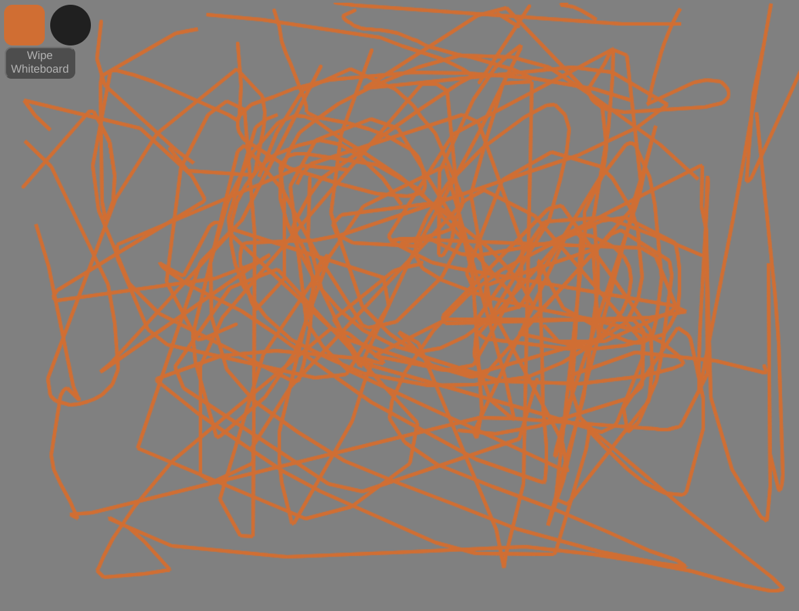

## What this whiteboard actually looks like

# Features of this whiteboard
- can change color

# Whiteboard Example

This application shows how to use the
[websocket](https://github.com/gorilla/websocket) [package](https://github.com/chapin666/simple-drawing-backend) to implement a simple
whiteboard application.

## Running the example

Build and run the server.

    $ go get github.com/gorilla/websocket
    $ cd `go list -f '{{.Dir}}' github.com/gorilla/websocket/examples/chat`
    $ go build -o server && ./server
    $ go run *.go

To use the whiteboard example, open http://localhost:3000/ in your browser.
