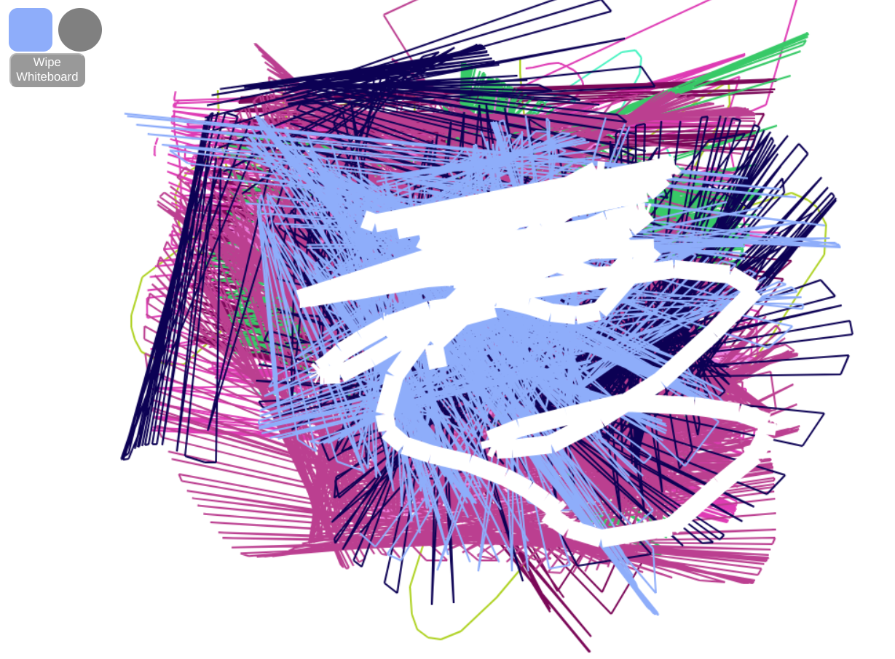

### What this actually looks like



# iogames drawing

- can change color

### Running

Buld and run the server.

```
$ go get github.com/gorilla/websocket
$ cd `go list -f '{{.Dir}}' github.com/gorilla/websocket/examples/chat`
$ go build -o server && ./server
$ go run *.go
```

To use the Drawing example, open http://localhost:8080/ in your browser.
